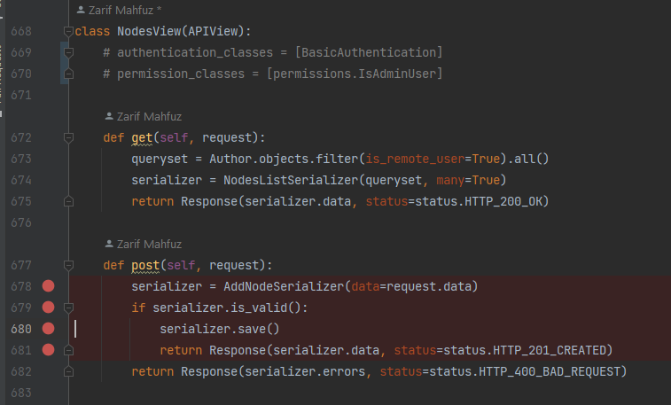
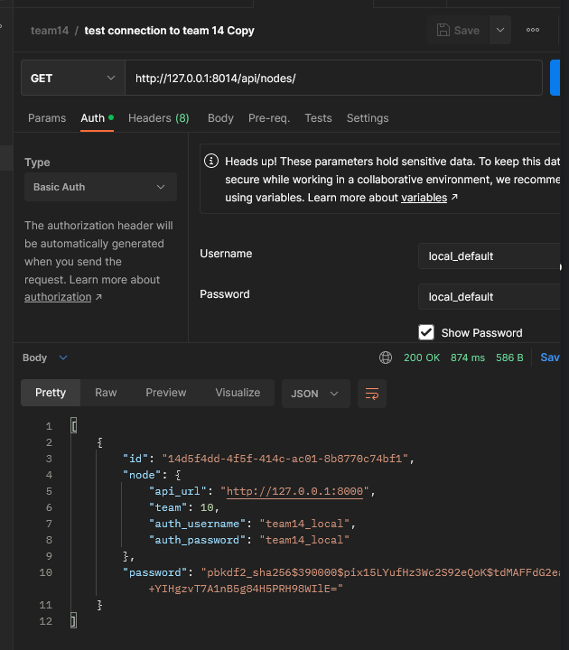

# Testing Other Teams

This guide is for local setup.

## Team 14

### Setup

Follow their setup: https://github.com/zarifmahfuz/project-socialdistribution#setup

When running their server, run it on port 8014:

```bash
python manage.py runserver 8014
```

### Creating a node on their server



Also we kinda need to comment out this lines to override auth. Quick way to do the call below

Call POST on `127.0.0.1:8014/api/nodes` with this payload:

```json
{
  "api_url": "http://127.0.0.1:8000/",
  "node_name": "local_default",
  "password": "local_default",
  "password2": "local_default",
  "auth_username": "team14_local",
  "auth_password": "team14_local",
  "team": 10
}
```

We call their endpoint with auth_username and auth_password.

They call our endpoint with node_name and password.

As a sanity check, try to connect to their endpoint as a node.



## Team 7

### Setup

1. First, you gotta install MongoDB: https://www.mongodb.com/try/download/community. Just choose all the default
   options!
2. Follow their setup: https://github.com/irriss-nn/group-cmput404-project#setup-virtual-environment
3. Change the port to 9007 in main.py.
   From:
   ```python
   if __name__ == "__main__":
        uvicorn.run("main:app", host="localhost", port=8000, reload=True)
   ```
   To:
   ```python
   if __name__ == "__main__":
        uvicorn.run("main:app", host="localhost", port=8007, reload=True)
   ```
   To test on our end, run the server in port 8007.
4. Run server with `python main.py`
